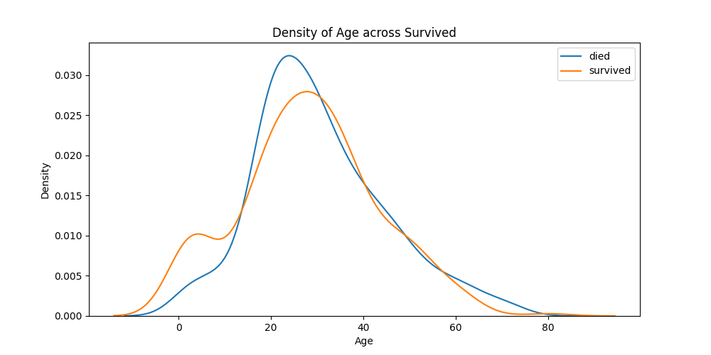
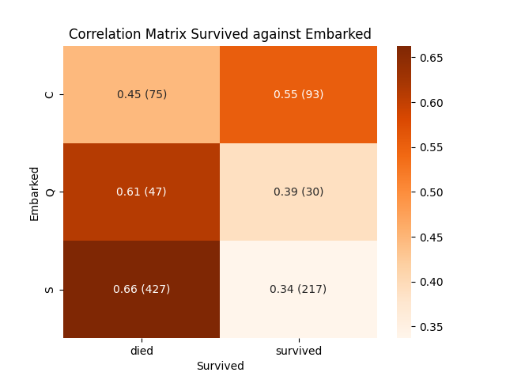
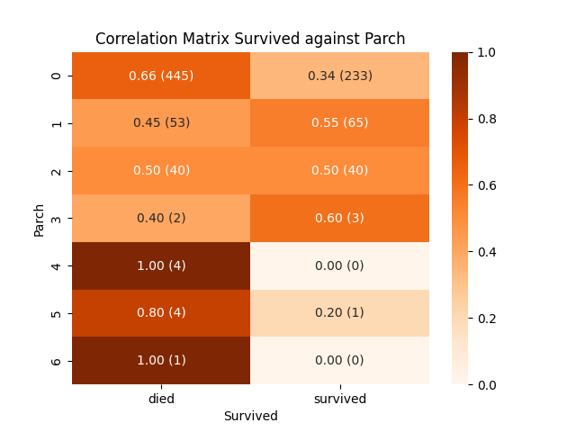
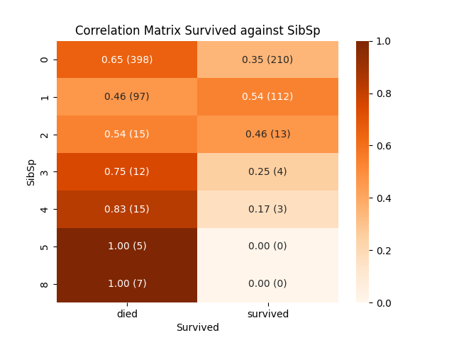
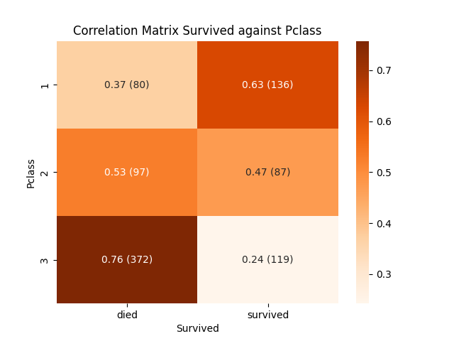
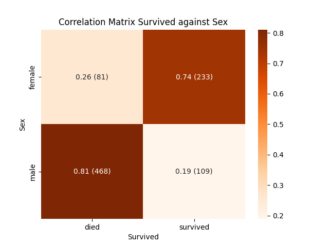
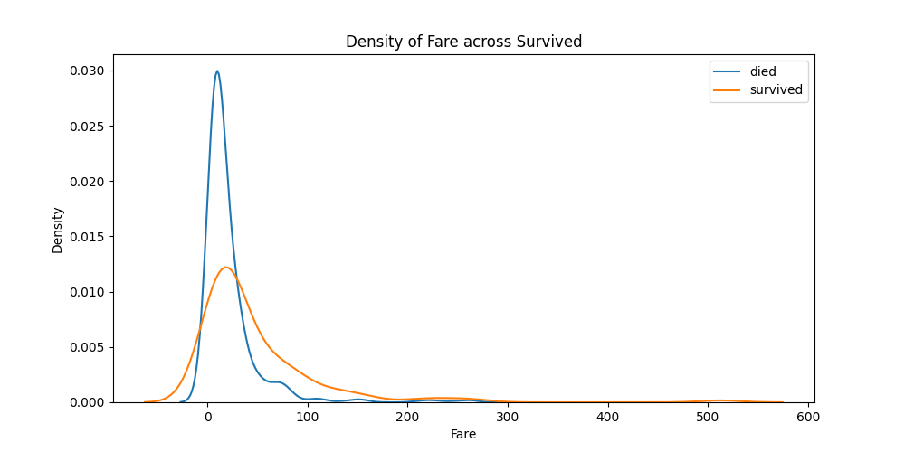
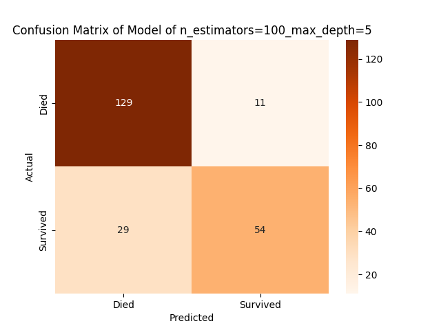

# Titanic_Survivor_Predictor_ML

## Task
Using the training set from the [_Titanic - Machine Learning from Disaster_](https://www.kaggle.com/competitions/titanic/overview) competition on kaggle a random forest classifier was trained to predict whether or not someone would survive the Titanic.
## Exploring the Data & Finding Correlations
The first step of developing this model was exploring the provided data. I was interested to see what features where correlated to someones survival. To measure this correlation correlation matrices where generated for discrete features while kernel density plots where made (split on someones survival) where made for continuous features.


<p float="left">
  
   
  
  
  
  
  
</p>

<!-- <div style="display: grid; grid-template-columns: 1fr 1fr; gap: 10px; center;">
 
  
  
  
  
  
  
</div> -->

The dataset provided the cabin numbers of everyone and it was observed some people where not assigned a cabin (the values where `nan`) so another column was added to check if there was a correlation for whether or not someone was assigned a cabin. Additionally, it was noted there was no clear correlation between the number of siblings/spouses aboard (`SibSp`) and the number of parents/children aboard (`Parch`) so another column was added which just checks is someone had any family aboard. Both of these newly calculated columns showed a correlation to the survival rate as shown in the plots below.

<div style="display: grid; grid-template-columns: 1fr 1fr; gap: 10px; center;">
  
  
</div>

From all the above plots it can be seen that the following features seems to have some correlation with the chances of survival as described.

* `Age:` Young people had a higher change of survival than older people.
* `Fare:` People who spent $\gtrapprox \$50$ on their ticket have a higher chance of survival.
* `Assigned Cabin:` People who did not have a cabin where more likely to die than those not in a cabin.
* `Embarked:` People who embarked in $S$ tended to die more frequently.
* `Family Onboard:` People with no family onboard died more frequently.
* `Pclass:` $1^{\text{st}}$ class passengers had a higher chance of survival then the lower classes and $3^{\text{rd}}$ class passengers had the lowest chance of survival.
* `Sex:` Men had a higher chance of dying than women.

The above features is what will be inputted to the random forest classifier to try to predict someones survival.

## Training the Model
The `RandomForestClassifier` from `sklearn.ensemble` (found [_here_](https://scikit-learn.org/stable/modules/generated/sklearn.ensemble.RandomForestClassifier.html)) was used as the machine learning model to predict the survival of passengers. Multiple instances where trained on the test data by varying the hyperparameters `n_estimators` and `max_depth` as specified in the `MODEL_HYPERPARAMETERS_FOR_TESTING` dictionary in `main.py`.

## Model Evaluation
Each model was evaluated my measuring the accuracy on both the training and validation data. Each of the models accuracy was then printed to the terminal, like in the example below.
```
#### MODEL: n_estimators=10_max_depth=10 Accuracies ################################
  training accuracy = 0.937125748502994
validation accuracy = 0.820627802690583
               diff = 0.11649794581241102
#### MODEL: n_estimators=100_max_depth=10 Accuracies ###############################
  training accuracy = 0.9580838323353293
validation accuracy = 0.7937219730941704
               diff = 0.16436185924115898
#### MODEL: n_estimators=200_max_depth=10 Accuracies ###############################
  training accuracy = 0.9535928143712575
validation accuracy = 0.8071748878923767
               diff = 0.14641792647888086
#### MODEL: n_estimators=100_max_depth=5 Accuracies ################################
  training accuracy = 0.8592814371257484
validation accuracy = 0.820627802690583
               diff = 0.03865363443516545
#### MODEL: n_estimators=100_max_depth=20 Accuracies ###############################
  training accuracy = 0.9850299401197605
validation accuracy = 0.7847533632286996
               diff = 0.20027657689106093
```
We want the model which has the highest validation accuracy as this is what is best at predicting the survival rate. However, we don't want a big difference between the training and validation accuracy as can be observed in most the the models. If the training accuracy is much higher than the validation accuracy then this means the model was overfit which means the model more or less memoried the answers other than finding a more general pattern.

Based on this we get the model which has the highest validation accuracy and the model with the smallest difference between training and validation accuracy. These two models accuracies are printed out again, in my case this looks like:
```
#### MODEL: Most Accurate Model (n_estimators=10_max_depth=10) Accuracies ##########
  training accuracy = 0.937125748502994
validation accuracy = 0.820627802690583
               diff = 0.11649794581241102
#### MODEL: Least Overfit Model (n_estimators=100_max_depth=5) Accuracies ##########
  training accuracy = 0.8592814371257484
validation accuracy = 0.820627802690583
               diff = 0.03865363443516545
```
Additionally, to better see the models predictions a confusion matrix is made for the above two models as shown below.
<div style="display: grid; grid-template-columns: 1fr 1fr; gap: 10px; center;">
 
  
</div>
Showing the predictions in the two models are not very skewed.
